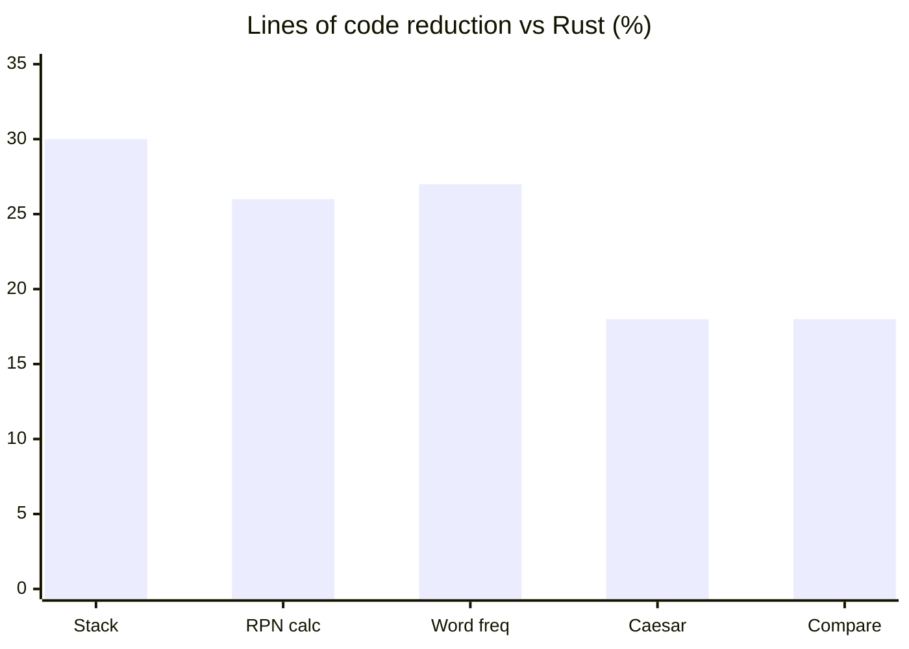
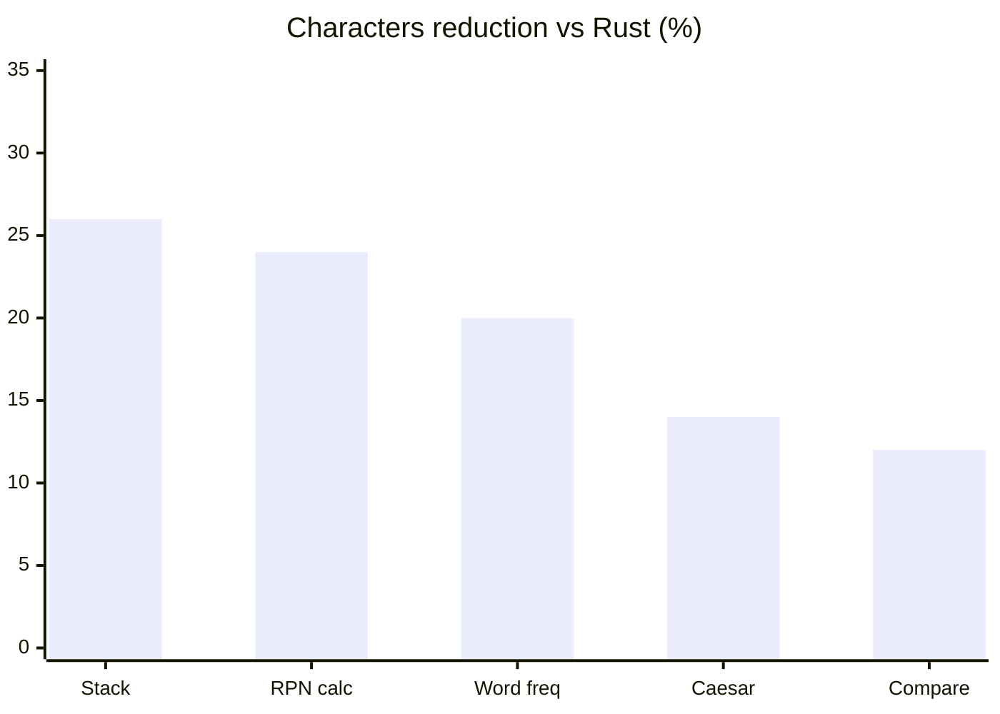
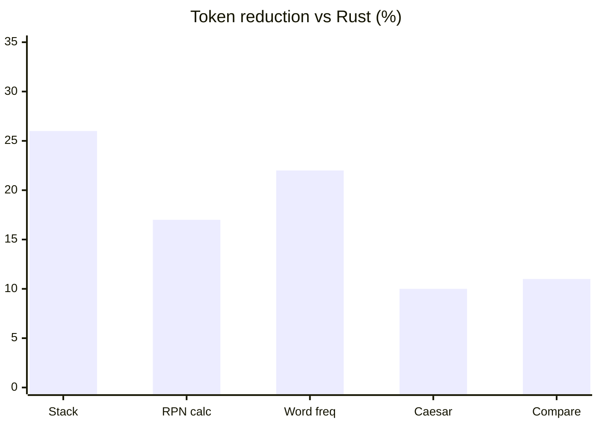

<p align="center">
  
</p>

# Dust

A programming language that compiles to Rust. Python-influenced syntax, indentation-based blocks, smart ownership defaults.

```dust
struct Stack
  values: Vec<f64>

  fn new() -> Stack
    Stack
      values: vec![]

  fn push(self, n: f64)
    self.values.push(n)

  fn pop(self) -> Option<f64>
    self.values.pop()

fn main()
  mut stack = Stack()
  stack.push(3.0)
  stack.push(4.0)
  println!("{stack.pop()}")
```

## Install

Requires Rust / Cargo.

```sh
git clone https://github.com/cemreefe/dust
cd dust
cargo install --path .
```

## Usage

```sh
dust run     hello.dust        # compile and run
dust compile hello.dust        # compile to binary
dust build   hello.dust        # emit hello.rs
```

## vs Rust

Consistently **~20–30% less code** across real programs, measured by lines, characters, and tokens:







| Program | Lines | Chars | Tokens |
|---------|-------|-------|--------|
| Stack struct | −30% | −26% | −26% |
| RPN calculator | −26% | −24% | −17% |
| Word frequency | −27% | −20% | −22% |
| Caesar cipher | −18% | −14% | −10% |
| This comparison script | −18% | −12% | −11% |

## Syntax

### Variables

```dust
let x = compute()   # inferred mutability — transpiler decides
mut x = compute()   # explicitly mutable
const X: i32 = 1    # explicitly immutable, value known at compile time
```

`let` is the default — use it when you don't care about mutability. `mut` opts into mutability explicitly. `const` requires a type annotation and a compile-time value.

### Functions

```dust
fn add(a: i32, b: i32) -> i32
  a + b
```

Auto-borrows string params (`str` → `&str`). Use `keep` to take ownership:

```dust
fn consume(keep name: str)     # name: String  — owns the value
fn read(name: str)             # name: &str    — borrows (default)
```

### Structs & Methods

```dust
struct Point
  x: f64
  y: f64

  fn new(x: f64, y: f64) -> Point
    Point
      x: x
      y: y

  fn distance(self) -> f64
    (self.x * self.x + self.y * self.y).sqrt()
```

`Type()` is sugar for `Type::new()`.

### Control Flow

```dust
if x > 0
  println!("positive")
elif x < 0
  println!("negative")
else
  println!("zero")
```

Inline form:

```dust
let label = if x > 0 then "pos" else "neg"
```

### Match

```dust
match status
  "ok"  -> println!("good")
  "err" -> println!("bad")
  _     -> println!("unknown")

match result
  Ok(v)  -> v
  Err(e) -> return "failed".to_string()
```

### Loops

```dust
for item in collection.iter()
  println!("{item}")

for (key, val) in map.iter()
  println!("{key}: {val}")

for line in stdin.lock().lines()
  let line = line.unwrap!
  println!("{line}")
```

### Operators

```dust
x++   x--          # increment / decrement
x += n   x -= n    # compound assign
x ||= y  x &&= y   # logical assign
```

### Closures

```dust
items.map(x -> x * 2)
items.sort_by(a, b -> a.cmp(b))
```

### Error handling

```dust
let val = risky().unwrap!      # .unwrap()
let val = risky()?             # propagate
```

### String interpolation

Any expression works inside `{}`. Format specs are passed through:

```dust
println!("Hello, {name}!")
println!("result: {stack.pop()}")
println!("x squared: {x * x}")
println!("{name:<12} {score:>5}")
```

### Casts & byte literals

```dust
let n = c as u8
let c = 65u8 as char
let byte = b'A'        # 65
```

### Tuples

```dust
fn minmax(v: Vec<i32>) -> (i32, i32)
  ...

for (key, val) in map.iter()
  ...

let x = pair.0
let y = pair.1
```

### Ownership

```dust
fn consume(keep buf: Vec<u8>)   # takes ownership
fn read(data: str)              # borrows (&str, default)
```

### Enums

```dust
enum Shape
  Circle(f64)
  Rect(f64, f64)
  Point
```

### Traits

```dust
struct Dog
  is Display

  fn Display.fmt(self, f: &mut Formatter) -> Result
    write!(f, "Dog")
```

## Examples

| File | Description |
|------|-------------|
| `examples/hello.dust` | Hello world |
| `examples/stack.dust` | Stack struct |
| `examples/rpn.dust` | RPN calculator (stdin) |
| `examples/caesar.dust` | Caesar cipher (stdin) |
| `examples/wordfreq.dust` | Word frequency counter (stdin) |
| `examples/compare.dust` | Dust vs Rust comparison script |
| `examples/todo_server.dust` | HTTP todo server with web frontend |

## How it works

Dust is a source-to-source transpiler:

```
.dust → Lexer → Parser → Semantic pass → Emitter → .rs → rustc → binary
```

- **Lexer** — indentation-aware (INDENT/DEDENT tokens), handles macros, char literals, byte literals, escape sequences
- **Parser** — recursive descent, produces a typed AST
- **Semantic pass** — auto-borrows params, infers mutability for `let` bindings, catches `const` mutation
- **Emitter** — walks AST, emits Rust source

The output is valid Rust. You can inspect it with `dust build`.
